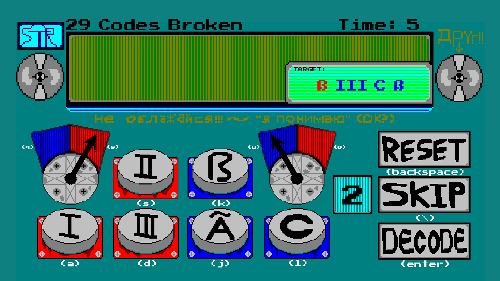

# Cryptologist

## About
Submitted to [Historically Accurate Game Jam #3](https://itch.io/jam/historically-accurate-3) and [Finally Finish Something 2021](https://itch.io/jam/finally-finish-something-2021), Cryptologist is a cool and groovy code breaking game. You, the player, work in a computer lab for your nation's army, and attempt to decipher the language of your enemies. Click Satisfying switches as you clack your way to victory, one code at a time, testing your reaction time and planning skills. Can you make it to round 151? 
 
## Screenshots

 
## Credits
**Ryan Feller:** Programming  
**BeeWizard:** Art 
Music from [Kevin MacLeod](https://www.youtube.com/channel/UCSZXFhRIx6b0dFX3xS8L1yQ) 

[Download](https://drive.google.com/uc?export=download&id=1ZwMed8JO2xFDrtBTEjw9Iu01jK0YgbU1){: .btn .btn-purple }

<iframe frameborder="0" src="https://itch.io/embed/873877?bg_color=eeeeee&amp;fg_color=3f2832&amp;link_color=3f2832&amp;border_color=3f2832" width="552" height="167"><a href="https://gamer-hangout.itch.io/cryptologist">Cryptologist by Gamer Hangout, Beewizard</a></iframe>

