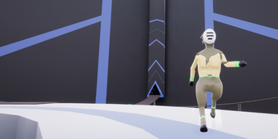
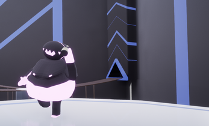
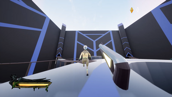

# Ichor
## About
Ichor was started with the intent of becoming a fps inspired by greek culture. Unfortunately, I became dissatisfied with the progress I was making and decided to call it quits. This is the first game I have made, but I did have some prior programming and 3d modeling knowledge. Forgive me if anything is broken, as version is only half-polished.

## Screenshots
{: width="450" }  
{: width="450" }  
{: width="450" }  

## Credits
**3d Modelers:** Jackie D., Len erd, Ryan Feller and Owen Metsger  
**2d Artists:** [JestQuest](https://jackc05.github.io/Portfolio/portfolio.html)  
**Programming:** Ryan Feller  

And of course, the game would have never gotten to its current state if it wasn't for all the wonderful playtesters who assisted in finding many of the broken bits of the game!

## Which Parts are My Work?
During this project, I did most of the 3d modeling (excluding the space themed rocket launcher, P250, and the CZ75), as well as acting as the sole programmer and the project lead.

[Download](https://drive.google.com/uc?export=download&id=11jMJeMAUZ5czp-dnOEANcYfCzUEGHqOu){: .btn .btn-purple }

<iframe frameborder="0" src="https://itch.io/embed/751125?bg_color=eeeeee&amp;fg_color=3f2832&amp;link_color=3f2832&amp;border_color=3f2832" width="552" height="167"><a href="https://gamer-hangout.itch.io/ichor">Ichor by Gamer Hangout</a></iframe>

