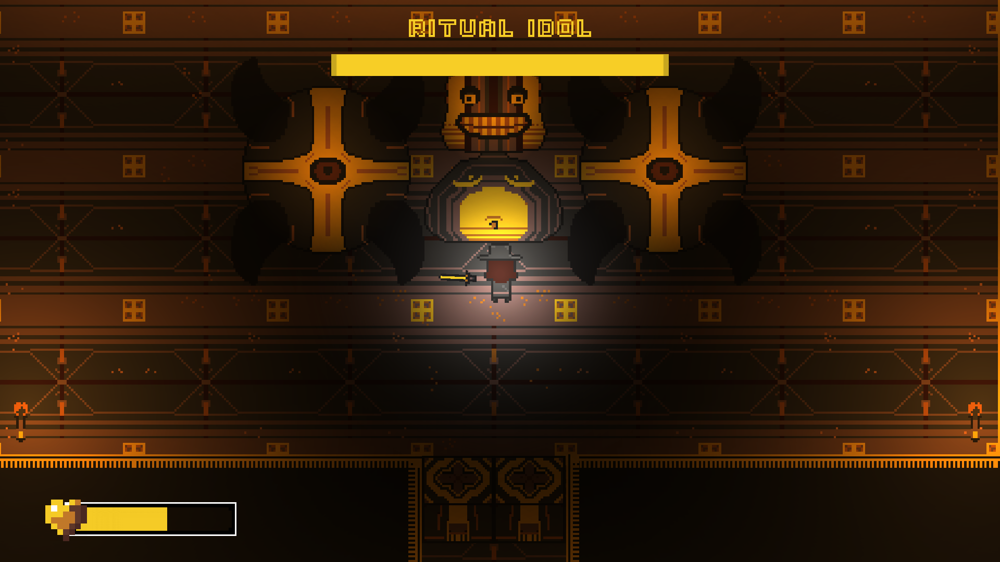
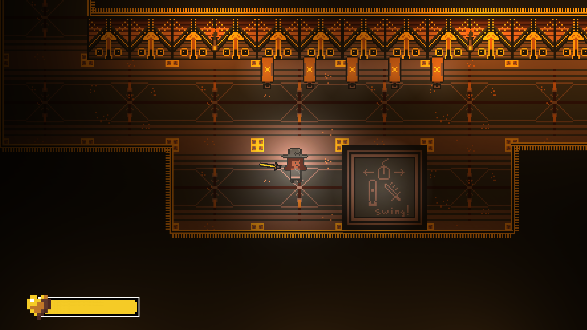
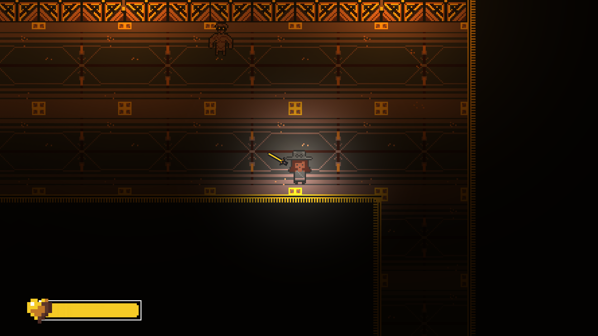

# Idol's Tower
## About
Idol's Tower is a quirky, Egyptian themed dungeon crawler all about sacrifice. Made in a week for [Blackthornprod GAME JAM #3](https://itch.io/jam/blackthornprod-game-jam-3) Zoom in to buff yourself, but sacrifice your precious vision. Slay mummies, mages, and even a gigantic Idol on your search for the Golden Ankh!

## Screenshots
  
  
  

## Credits
Art: Ryan Feller

Programming: [Hristo Kalinov](https://hkalinov.itch.io/), [sengbschbep](https://sengbschbep.itch.io/), and Ryan Feller

Music: [Peter Kaku](https://peterkaku.com/)

## Which Parts are My Work?
For this game, I acted as the project lead, artist, and a programmer.

[Download](https://drive.google.com/uc?export=download&id=1QdwKD2IMYQurodDoey6Qr2Rap3yM3Dec){: .btn .btn-purple }

<iframe frameborder="0" src="https://itch.io/embed/872278?bg_color=eeeeee&amp;fg_color=3f2832&amp;link_color=3f2832&amp;border_color=3f2832" width="552" height="167"><a href="https://gamer-hangout.itch.io/idolstower">Idol's Tower by Gamer Hangout, sengbschbep, Peter Kaku, Hristo Kalinov</a></iframe>

