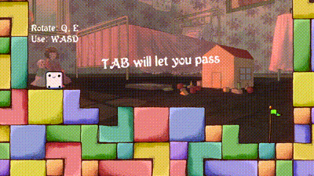
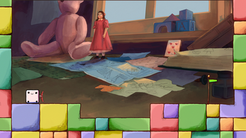
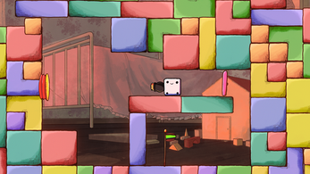

# Little Dice

### About
Made in just **48 hours** for the [GMTK Game Jam 2022](https://itch.io/jam/gmtk-jam-2022)!

### Screenshots
  
  
  

### Our Team  
**Programming:** Victor Ghys and Ryan Feller 
**Art:** JestQuest and Lilly Martin 
**Sound:** Thomas Thoreau 

### Which Parts are My Work?
During this jam, I came up with the concept, programmed the rolling, cannon attachment, grapple attachment, and helped with the fist mechanic. I also designed levels 2,3,4,5,6,7, and 9.

[Play in Browser](https://victorghys.itch.io/little-dice){: .btn .btn-purple }
<iframe frameborder="0" src="https://itch.io/embed/1610223?bg_color=eeeeee&amp;fg_color=3f2832&amp;link_color=3f2832&amp;border_color=3f2832" width="552" height="167"><a href="https://victorghys.itch.io/little-dice">Little Dice by Victor Ghys, JestQuest, lilly, Gamer Hangout</a></iframe>
