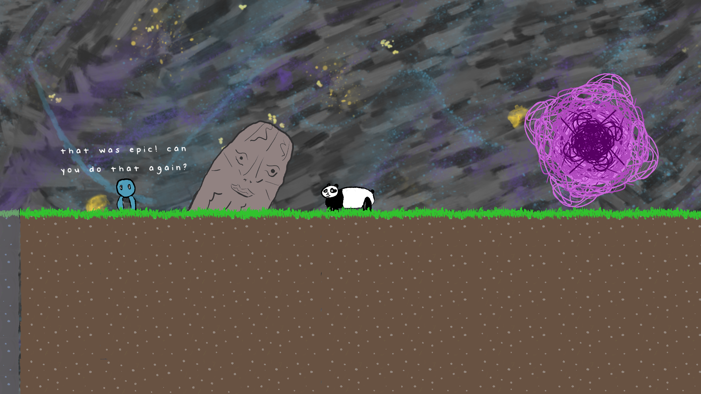
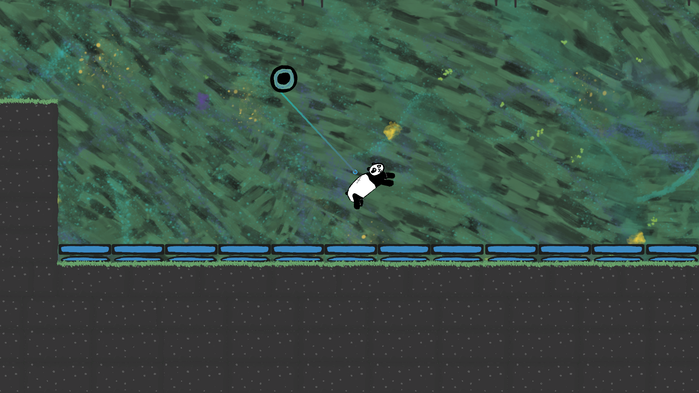
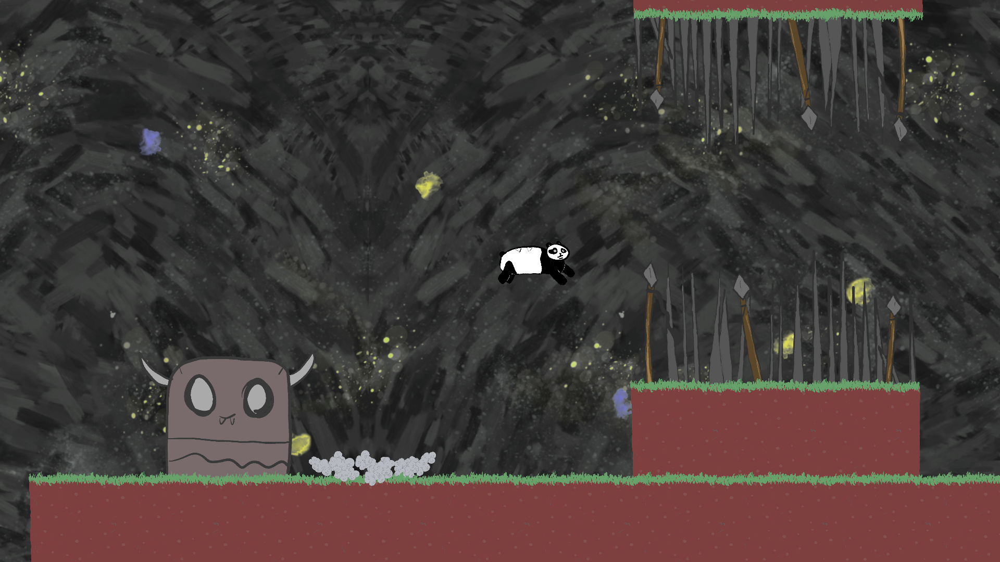

# Panda In Space
## About
Made for the [Beginner's Circle Jam #3](https://itch.io/jam/beginners-circle-jam-3)! Different planets have different gravity, right? So I decided to make the gravity change depending on the level, as well as implementing mechanics that I thought would be fun with low gravity.

## Screenshots

## Which Parts are My Work?
All of it!

[Download](https://drive.google.com/uc?export=download&id=1j_fKe6_t5HKJdO1_RZ1LuGplUEJSaN9K){: .btn .btn-purple }

<iframe frameborder="0" src="https://itch.io/embed/796039?bg_color=eeeeee&amp;fg_color=3f2832&amp;link_color=3f2832&amp;border_color=3f2832" width="552" height="167"><a href="https://gamer-hangout.itch.io/panda-in-space">Panda in Space by Gamer Hangout</a></iframe>

