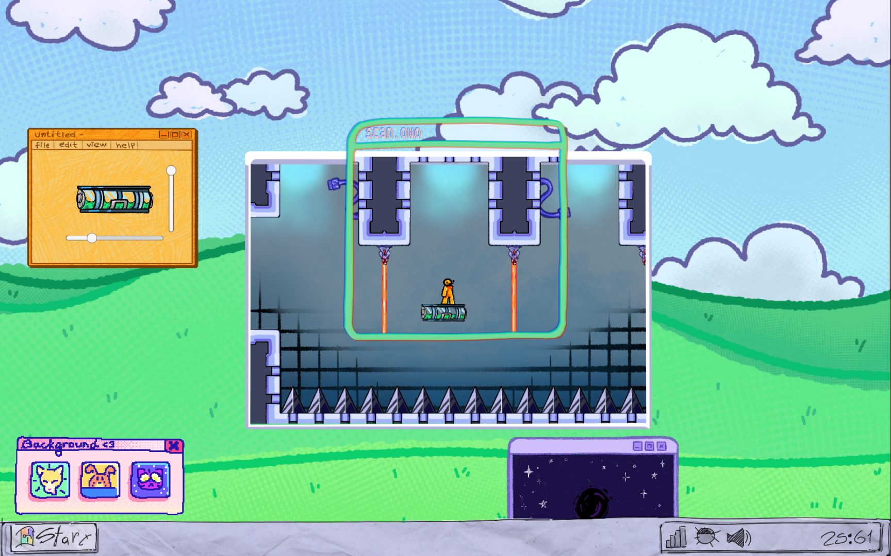
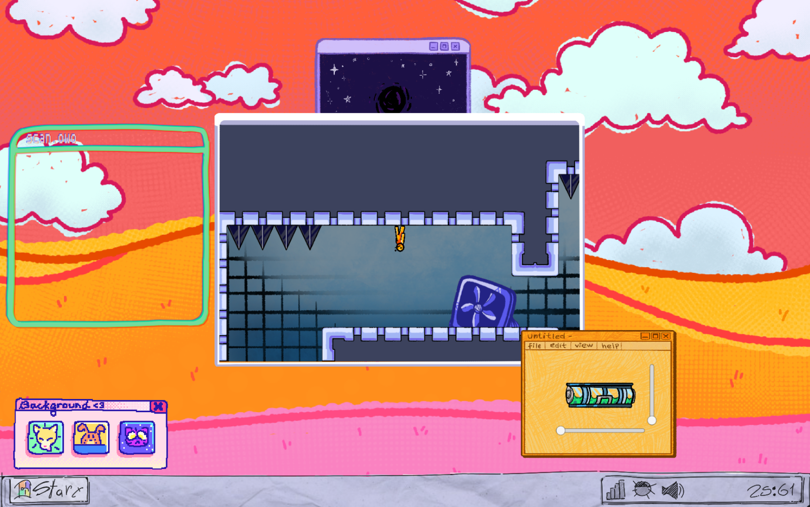
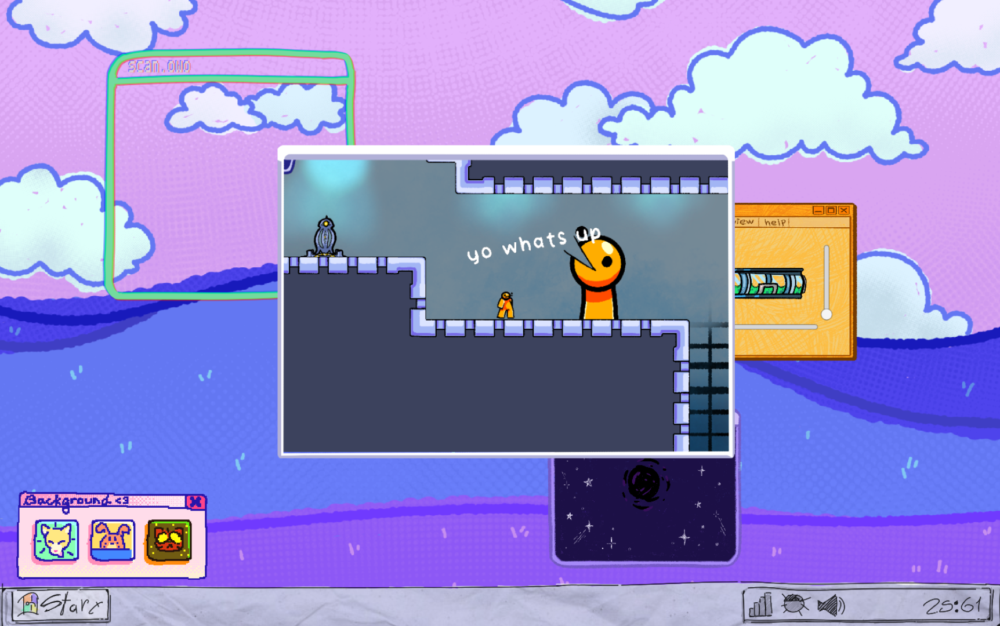

# Runner OS

## About
Embark on a whimsical adventure on none other than a computer dekstop overrun by viruses! On this platform game you control Aley, a friendly orange guy that's trying to deliver a message while getting relentlessly attacked by malicious pop ups. Don't panic though! You'll also get windows of different kinds that'll either help or hinder your quest depending on how you use them.

This game was created in just 48 hours for the [GMTK 2021 Game Jam](https://itch.io/jam/gmtk-2021)!

## Screenshots
{: width="450" }  
{: width="450" }  
{: width="450" }  
## Credits
**Programming:** [Propergandev](https://twitter.com/Propergandev) and Ryan Feller

**Art:** [Val](https://twitter.com/drowsyval), Mlem and [JestQuest](https://jackc05.github.io/Portfolio/portfolio.html)

## Which Parts are My Work?
During this project, my primary role was gameplay programmer. I programmed the functionality of the character's movement, the gravity window, the checkpoints, the spikes, the lasers, the platforms, and helped program scripts related to the UI of the game's desktop. I also implemented a majority of the art provided by artists, especially within the game window.

[Download](https://drive.google.com/uc?export=download&id=188jAR9XaQv1vsbx4LzbOGi47qtX5KZ5M){: .btn .btn-purple }
<iframe frameborder="0" src="https://itch.io/embed/1085165?bg_color=eeeeee&amp;fg_color=3f2832&amp;link_color=3f2832&amp;border_color=3f2832" width="552" height="167"><a href="https://abhorrentpropaganda.itch.io/runneros">RunnerOS by AbhorrentPropaganda, Gamer Hangout, Mlem, JestQuest, val</a></iframe>
