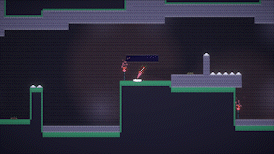
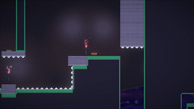
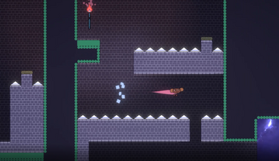

# Sublime Monkey Perfection
Dash, J u m p, and Bounce through the levels to sacrifice yourself!
### Screenshots
  
  
  

### Credits
Programming, Art, Design, Project Lead: Ryan

Art, Design: Dusty

Design, Music, a little programming: Michael

Info
This game is inspired by the popular francise Monkey Kong. The game is about a choice between control and chaos, the Funky Monkey or the Chunky Monkey. This mechanic informed the rest of our design choices! We also knew that we wanted to keep the game accessible to everyone, so we added key remapping and assist mode, despite the smaller scale of the game (: For those who want an extra challenge, you can take on 3 bonus levels unlocked only after completing the 10 level campaign. 

We Hope you Enjoy!  
[Download](https://drive.google.com/uc?export=download&id=1Z_ti38R9KcHBKNoxFFolsxnrn3RD4mF_){: .btn .btn-purple}
<iframe frameborder="0" src="https://itch.io/embed/1330003?bg_color=eeeeee&amp;fg_color=3f2832&amp;link_color=3f2832&amp;border_color=3f2832" width="552" height="167"><a href="https://gamer-hangout.itch.io/monkey-kong">Sublime Monkey Perfection by Gamer Hangout, Cuora / Depths, Rowannie</a></iframe>
