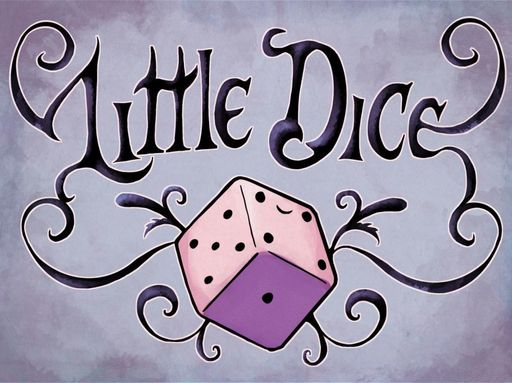
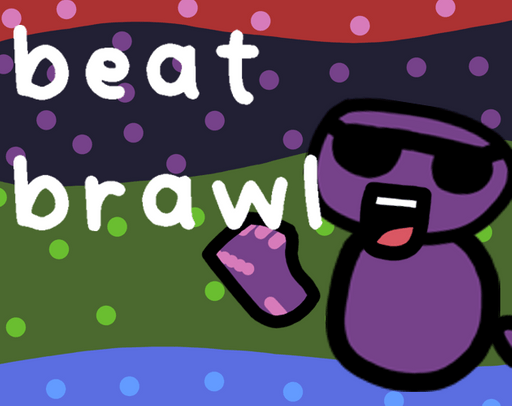
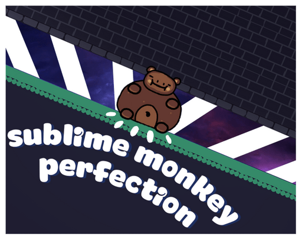
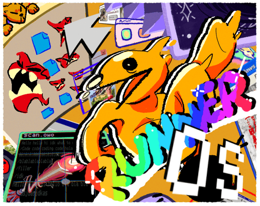
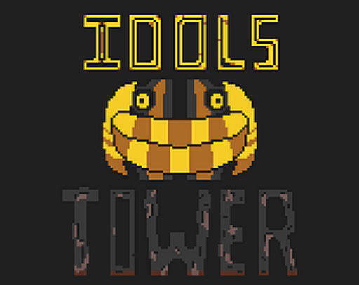
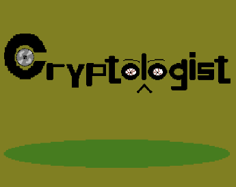
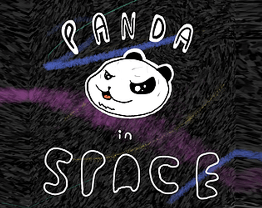
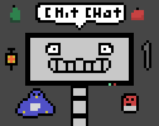
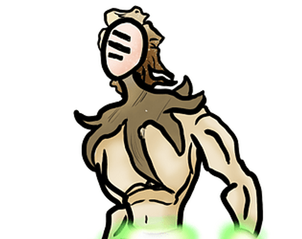

# Home  

## About
**Hello! My name is Ryan Feller, and I am a student, programmer, and game developer!**   This is my website portfolio, where you can find some of my personal projects, contact info, and more!

## Research

### Accessibiliy vs Enjoyment in Digital games
I wrote this research paper for AP Research and for my EE. I decided to perform this research in an attempt to contribute to the ongoing discourse of accessibility in games. You can download the PDF by pressing the button below.  
[Download](https://drive.google.com/uc?export=download&id=1RrOEMaKWy14KTsGucp8P5pxpRyqkCQDx){: .btn .btn-purple }

## Games

At the time of writing, I have completed 9 game projects. More are in the works!

### Little Dice
{: width="324" }  
[Find out More About This Game](https://ryanff72.github.io/Games/LittleDice.html){: .btn .btn-purple }

### Beat Brawl
{: width="324" }  
[Find out More About This Game](https://ryanff72.github.io/Games/BeatBrawl.html){: .btn .btn-purple }

### Sublime Monkey Perfection
{: width="324" }  
[Find out More About This Game](https://ryanff72.github.io/Games/SublimeMonkeyPerfection.html){: .btn .btn-purple }

### RunnerOS
{: width="324" }  
[Find out More About This Game](https://ryanff72.github.io/Games/RunnerOS.html){: .btn .btn-purple }

### Idol's Tower
{: width="324" }  
[Find out More About This Game](https://ryanff72.github.io/Games/Idol'sTower.html){: .btn .btn-purple }

### Cryptologist
{: width="324" }  
[Find out More About This Game](https://ryanff72.github.io/Games/Cryptologist.html){: .btn .btn-purple }

### Panda in Space
{: width="324" }  
[Find out More About This Game](https://ryanff72.github.io/Games/PandaInSpace.html){: .btn .btn-purple }

### Chit Chat
{: width="324" }  
[Find out More About This Game](https://ryanff72.github.io/Games/ChitChat.html){: .btn .btn-purple }

### Ichor
{: width="324" }  
[Find out More About This Game](https://ryanff72.github.io/Games/Ichor.html){: .btn .btn-purple }

